# 第二阶段rust for linux 作业

实验环境：wsl2+Ubuntu22.04

## 目录

- [第二阶段rust for linux 作业](#第二阶段rust-for-linux-作业)
  - [目录](#目录)
  - [环境搭建](#环境搭建)
    - [配置BusyBox](#配置busybox)
    - [配置Linux文件夹](#配置linux文件夹)
  - [作业1：编译Linux内核](#作业1编译linux内核)
  - [作业2：对Linux内核进行一些配置](#作业2对linux内核进行一些配置)
    - [问题1、编译成内核模块，是在哪个文件中以哪条语句定义的？](#问题1编译成内核模块是在哪个文件中以哪条语句定义的)
    - [问题2、该模块位于独立的文件夹内，却能编译成Linux内核模块，这叫做out-of-tree module，请分析它是如何与内核代码产生联系的？](#问题2该模块位于独立的文件夹内却能编译成linux内核模块这叫做out-of-tree-module请分析它是如何与内核代码产生联系的)
    - [禁用默认网卡](#禁用默认网卡)
    - [编译e1000网卡](#编译e1000网卡)
    - [加载e1000网卡](#加载e1000网卡)
  - [作业3：使用rust编写一个简单的内核模块并运行](#作业3使用rust编写一个简单的内核模块并运行)
  - [作业4：为e1000网卡驱动添加remove代码](#作业4为e1000网卡驱动添加remove代码)
  - [作业5：注册字符设备](#作业5注册字符设备)

## 环境搭建

### 配置BusyBox

```
cd busybox-1.36.1

make menuconfig

Settings
          ---> [*] Build static binary (no shared libs)
```

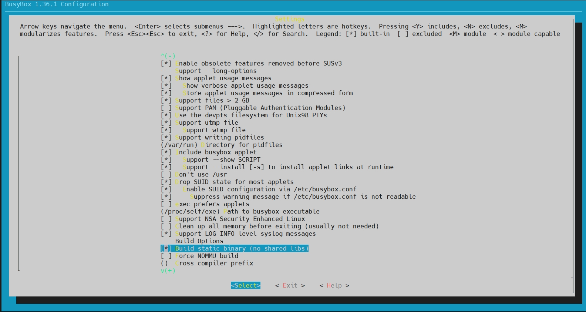

```
make install -j16
```

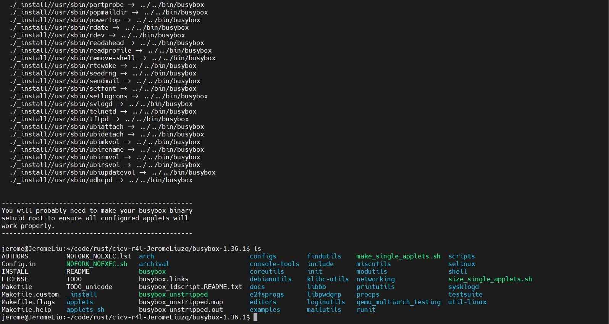

### 配置Linux文件夹

```
cd linux
# 将此目录中的rustc重置为特定版本
# 可提前为rustup设置代理，以便加速下载过程，参考上一节“安装Rust”中的说明
rustup override set $(scripts/min-tool-version.sh rustc)
# 添加rust-src源代码
rustup component add rust-src
# 安装clang llvm，该项一般在配置内核时已经安装，若已安装此处可忽略
apt install clang llvm

# 可为cargo仓库crates.io设置使用镜像，参考上一节“安装Rust”中的说明
# 安装bindgen工具，注意在0.60版本后，bindgen工具的命令行版本位于bindgen-cli包中
cargo install --locked --version $(scripts/min-tool-version.sh bindgen) bindgen
# 安装rustfmt和clippy
rustup component add rustfmt
rustup component add clippy
# 检查内核rust支持已经启用
make LLVM=1 rustavailable
```

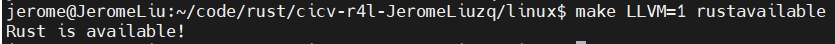

## 作业1：编译Linux内核

```
make x86_64_defconfig
make LLVM=1 menuconfig
#set the following config to yes
General setup
        ---> [*] Rust support
make LLVM=1 -j16
```

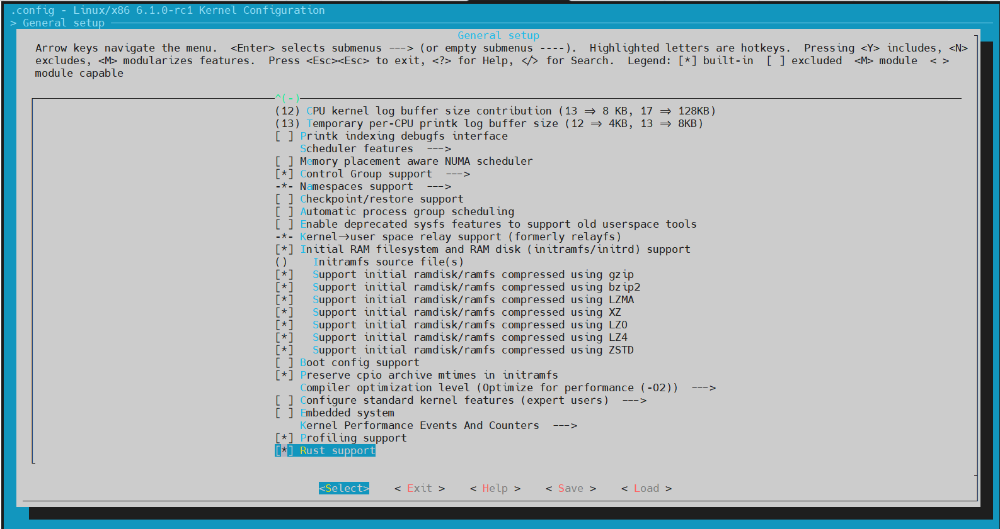

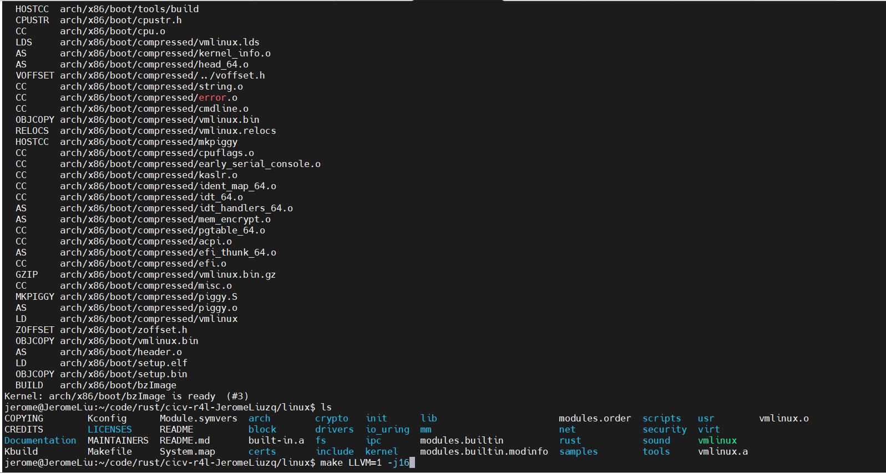

## 作业2：对Linux内核进行一些配置

### 问题1、编译成内核模块，是在哪个文件中以哪条语句定义的？

```
答：Kbuild文件里的obj-m := r4l_e1000_demo.o
```

### 问题2、该模块位于独立的文件夹内，却能编译成Linux内核模块，这叫做out-of-tree module，请分析它是如何与内核代码产生联系的？

```
答：Makefile中通过-C指定linux内核位置，而M=$(PWD)指定驱动源码位置。内核顶层的Makefile检查到M非空时，会编译该模块为外部module。
```

### 禁用默认网卡

```
cd linux
make LLVM=1 menuconfig
Device Drivers > Network device support > Ethernet driver support > Intel devices, Intel(R) PRO/1000 Gigabit Ethernet support）


make LLVM=1 -j16
```

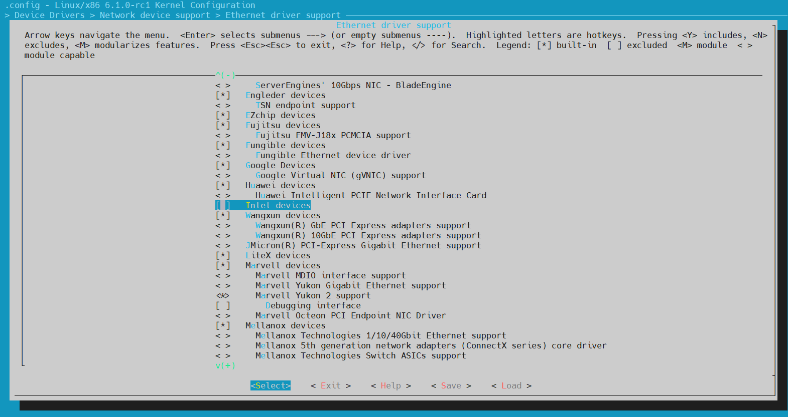

### 编译e1000网卡

```
cd src_e1000

make LLVM=1 -j16
```

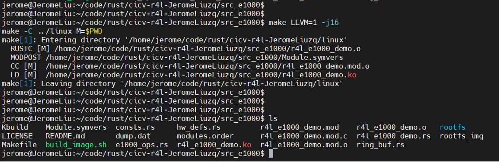

### 加载e1000网卡

```
./build_image.sh

insmod r4l_e1000_demo.ko
ip link set eth0 up
ip addr add broadcast 10.0.2.255 dev eth0
ip addr add 10.0.2.15/255.255.255.0 dev eth0 
ip route add default via 10.0.2.1
ping 10.0.2.2
```

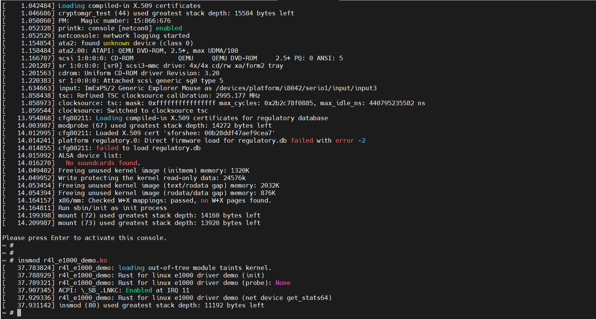

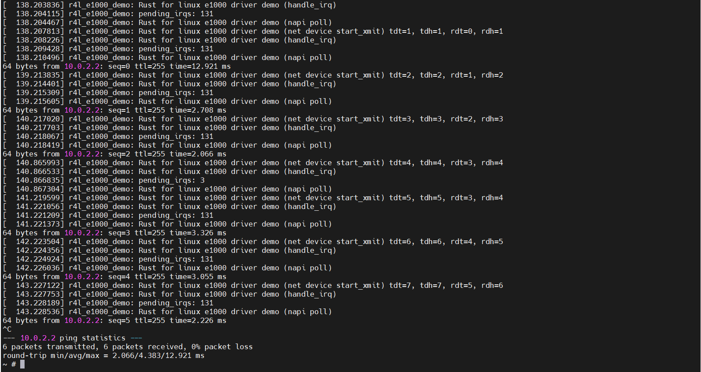

## 作业3：使用rust编写一个简单的内核模块并运行

```
diff --git a/linux/samples/rust/Kconfig b/linux/samples/rust/Kconfig
index 189c10ced..d2bed04c1 100644
--- a/linux/samples/rust/Kconfig
+++ b/linux/samples/rust/Kconfig
@@ -163,4 +163,11 @@ config SAMPLE_RUST_SELFTESTS

          If unsure, say N.

+config SAMPLE_RUST_HELLOWORLD
+       tristate "Hello World"
+       help
+         This option builds the self test cases for Rust.
+
+         If unsure, say N.
+
 endif # SAMPLES_RUST
diff --git a/linux/samples/rust/Makefile b/linux/samples/rust/Makefile
index 420bcefeb..30bc785d3 100644
--- a/linux/samples/rust/Makefile
+++ b/linux/samples/rust/Makefile
@@ -15,5 +15,6 @@ obj-$(CONFIG_SAMPLE_RUST_NETFILTER)           += rust_netfilter.o
 obj-$(CONFIG_SAMPLE_RUST_ECHO_SERVER)          += rust_echo_server.o
 obj-$(CONFIG_SAMPLE_RUST_FS)                   += rust_fs.o
 obj-$(CONFIG_SAMPLE_RUST_SELFTESTS)            += rust_selftests.o
+obj-$(CONFIG_SAMPLE_RUST_HELLOWORLD)           += rust_helloworld.o

 subdir-$(CONFIG_SAMPLE_RUST_HOSTPROGS)         += hostprogs
diff --git a/src_e1000/build_image.sh b/src_e1000/build_image.sh
index afe26d626..f243a4bfb 100755
--- a/src_e1000/build_image.sh
+++ b/src_e1000/build_image.sh
@@ -4,6 +4,7 @@ kernel_image="../linux/arch/x86/boot/bzImage"
 work_dir=$PWD
 rootfs="rootfs"
 rootfs_img=$PWD"/rootfs_img"
+hellworld_path="../linux/samples/rust"

 make LLVM=1
 echo $base_path
@@ -12,6 +13,7 @@ if [ ! -d $rootfs ]; then
 fi
 cp $busybox_folder/_install/*  $rootfs/ -rf
 cp $work_dir/r4l_e1000_demo.ko $work_dir/$rootfs/
+cp $hellworld_path/rust_helloworld.ko $work_dir/$rootfs/
 cd $rootfs
 if [ ! -d proc ] && [ ! -d sys ] && [ ! -d dev ] && [ ! -d etc/init.d ]; then
     mkdir proc sys dev etc etc/init.d
```

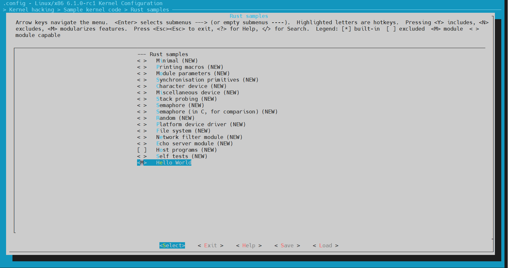

```
insmod rust_helloworld.ko

dmesg
```

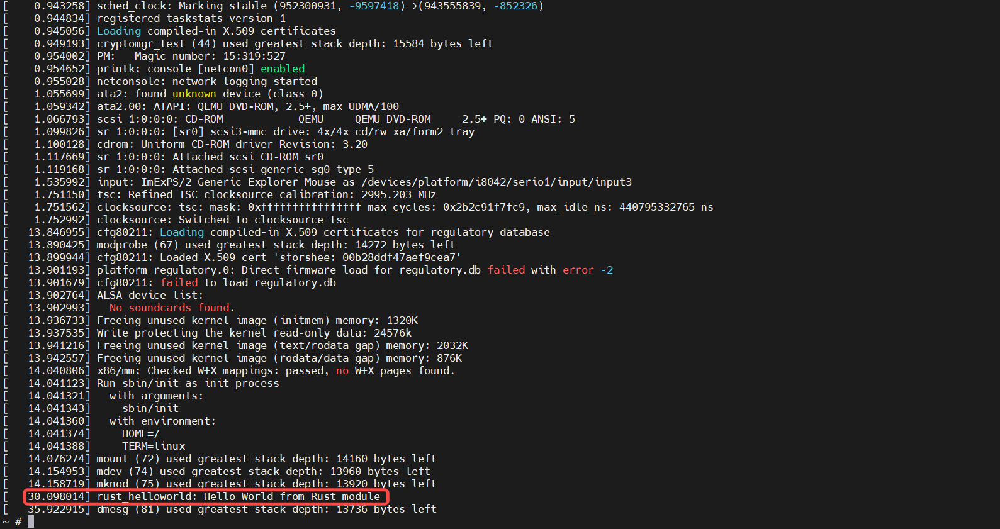


## 作业4：为e1000网卡驱动添加remove代码

## 作业5：注册字符设备

